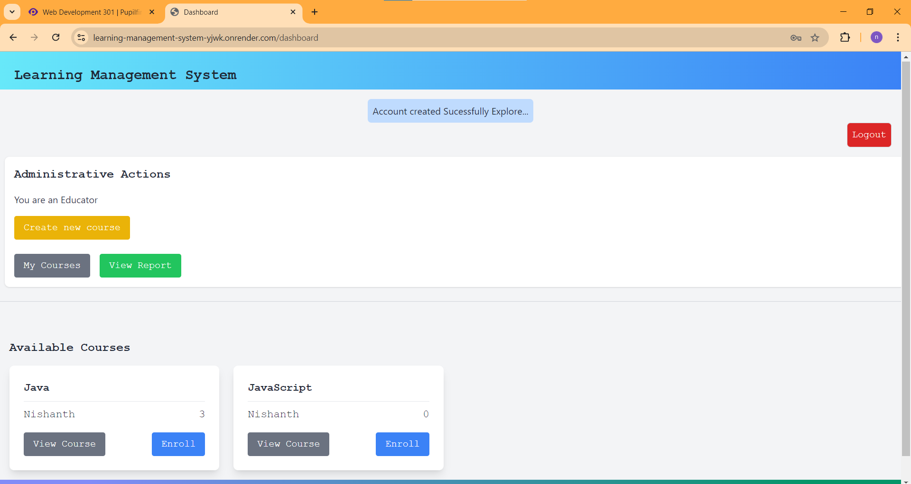

# Learning Management System (LMS)

## Overview

The Learning Management System (LMS) is an online platform designed to enhance interactions between educators and students. It allows educators to create courses, organize them into chapters and pages, while students can register, enroll in courses, access course content, mark pages as complete, and track their progress.

**Application URL:** [Website](https://learning-management-system-yjwk.onrender.com/)

***Demo Video URL:*** 
- [Demo Link](https://www.loom.com/share/38ffea2eab114f85b959b0ecf6194b41?sid=ff9450bc-1559-42bb-8228-558e362f7253)
- [Continuation Part](https://www.loom.com/share/24a3d46485dc44c684eb0b16d466e5ae?sid=17cbac50-662c-4204-8c9b-76ccfab58b06)

## Key Features

### For Educators

#### Course Management
- **Create Courses:** Educators can initiate courses by naming and structuring them.
- **Organize Chapters:** Courses can be segmented into chapters for clarity.
- **Add Pages:** Educators can populate each chapter with detailed pages.

#### Reporting
- **Enrollment Reports:** View reports that show the number of students enrolled in each course and the course’s popularity.

### For Students

#### Account Management
- **Sign Up:** New users can create an account by providing their name, email, and password.
- **Log In:** Registered users can log in with their credentials.
- **Log Out:** All users have the option to log out securely.

#### Course Enrollment and Learning
- **Enroll in Courses:** Students can enroll to gain access to course content.
- **View Chapters:** Preview a course's chapter list before enrolling.
- **Display Enrolled Courses:** Enrolled courses are displayed in a separate section for easy access.
- **Track Progress:** Students can mark pages as complete to track their learning progress.
- **View Progress Status:** A completion percentage or progress indicator is available to show how much of the course has been completed.

### Security Features
- **Secure Login:** Users are protected by a secure login system that prevents unauthorized access.
- **Password Protection:** Passwords are hashed and stored securely to prevent unauthorized access.
- **HTTPS:** The application uses HTTPS to ensure all data exchanged between the client and server is encrypted
- **CSRF Protection:** The application protects against cross-site request forgery attacks.
- **Validation:** With Postgres SQL validation checks before adding to the Database Entry.
- **Error Handling:** The application handles errors gracefully, providing users with clear and actionable feedback.

## Screenshots
`Root Page`

`SignUp Page`

`Login Page`

`ForgotPassword Page`

`Educator Dashboard Page`

`Student Dashboard Page`

`Add Course Page`

`Add Chapter Page`

`Add Page`

`Show chapter Page`

`My Courses Page`

`Report Page`

### Thank You

